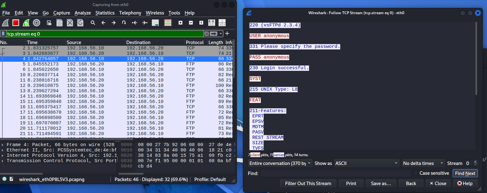

# 🛡️ Laboratório de Segurança de Redes

Projeto prático de Segurança da Informação desenvolvido em ambiente virtualizado e isolado, com o objetivo de praticar conceitos de redes, Linux, reconhecimento de serviços, análise de tráfego e identificação de configurações inseguras.

O laboratório utiliza uma máquina Kali Linux como estação de análise e uma máquina Metasploitable 2 como servidor vulnerável de testes.

Todos os testes apresentados neste projeto foram realizados exclusivamente em ambiente controlado e propositalmente vulnerável.

---

## 📌 Objetivos do Projeto

Os principais objetivos deste laboratório foram:

- Criar um ambiente virtualizado para estudos de Segurança da Informação;
- Configurar uma rede interna isolada;
- Identificar dispositivos ativos na rede;
- Realizar enumeração de portas e serviços;
- Identificar versões de softwares disponíveis;
- Analisar protocolos de rede;
- Capturar e interpretar tráfego utilizando Wireshark;
- Identificar configurações inseguras;
- Comparar protocolos seguros e inseguros;
- Documentar evidências técnicas;
- Produzir recomendações de segurança.

---

## 🖥️ Ambiente do Laboratório

O laboratório foi criado utilizando Oracle VirtualBox.

### Máquina de análise

**Sistema:** Kali Linux

**Endereço IP:**

```text
192.168.56.10
```

### Máquina vulnerável

**Sistema:** Metasploitable 2

**Endereço IP:**

```text
192.168.56.20
```

### Rede

```text
192.168.56.0/24
```

As duas máquinas foram configuradas em uma rede interna do VirtualBox chamada:

```text
Cyberlab
```

A utilização de uma rede interna impede que a máquina propositalmente vulnerável fique diretamente exposta à rede doméstica.

---

## 🌐 Topologia

```text
        Rede interna VirtualBox
             Cyberlab

┌──────────────────────┐
│      Kali Linux      │
│                      │
│    192.168.56.10     │
│                      │
│ Máquina de análise   │
└──────────┬───────────┘
           │
           │
           │
┌──────────┴───────────┐
│   Metasploitable 2   │
│                      │
│    192.168.56.20     │
│                      │
│  Servidor vulnerável │
└──────────────────────┘
```

---

## 🛠️ Ferramentas utilizadas

Durante o projeto foram utilizadas as seguintes ferramentas:

- Oracle VirtualBox
- Kali Linux
- Metasploitable 2
- Nmap
- Wireshark
- smbclient
- MySQL/MariaDB Client
- curl
- WhatWeb
- FTP Client
- Telnet Client
- SSH Client

---

# 🔎 1. Descoberta de Hosts

A primeira etapa foi identificar quais dispositivos estavam ativos dentro da rede do laboratório.

Foi utilizado:

```bash
sudo nmap -sn 192.168.56.0/24
```

A opção:

```text
-sn
```

realiza descoberta de hosts sem executar a varredura padrão de portas.

### Resultado

Foram identificados dois hosts ativos:

```text
192.168.56.10
192.168.56.20
```

Correspondendo respectivamente ao Kali Linux e ao Metasploitable.

### Conhecimentos utilizados

- Endereçamento IPv4;
- Máscara de rede;
- Redes /24;
- Descoberta de hosts;
- Nmap.

---

# 🔍 2. Enumeração de Portas e Serviços

Após identificar o servidor Metasploitable, foi realizada a enumeração das portas TCP.

Comando utilizado:

```bash
sudo nmap -sS -sV 192.168.56.20
```

### Parâmetros

```text
-sS
```

Realiza uma varredura TCP SYN.

```text
-sV
```

Tenta identificar o serviço e a versão do software executado nas portas encontradas.

---

## Principais serviços identificados

| Porta | Serviço | Tecnologia identificada |
|---|---|---|
| 21/TCP | FTP | vsftpd 2.3.4 |
| 22/TCP | SSH | OpenSSH |
| 23/TCP | Telnet | Linux telnetd |
| 25/TCP | SMTP | Postfix |
| 53/TCP | DNS | ISC BIND |
| 80/TCP | HTTP | Apache 2.2.8 |
| 139/TCP | SMB | Samba |
| 445/TCP | SMB | Samba |
| 1524/TCP | Bind Shell | Metasploitable root shell |
| 2049/TCP | NFS | NFS |
| 3306/TCP | MySQL | MySQL 5.0.51a |
| 5432/TCP | PostgreSQL | PostgreSQL |
| 5900/TCP | VNC | VNC |
| 6667/TCP | IRC | UnrealIRCd |
| 8180/TCP | HTTP | Apache Tomcat |

A enumeração demonstrou uma grande superfície de ataque devido à quantidade de serviços disponíveis.

---

# 📁 3. Análise do serviço FTP

Durante a enumeração foi identificado:

```text
21/tcp open ftp vsftpd 2.3.4
```

Foi realizada uma análise específica da porta 21.

Comando utilizado:

```bash
sudo nmap -p 21 -sV --script ftp-anon,ftp-syst 192.168.56.20
```

---

## 🔓 Acesso FTP anônimo

O Nmap identificou:

```text
Anonymous FTP login allowed
```

O acesso foi então confirmado manualmente.

Comando:

```bash
ftp 192.168.56.20
```

Credenciais utilizadas:

```text
Usuário: anonymous
Senha: anonymous
```

O servidor retornou:

```text
230 Login successful.
```

Isso confirmou que o serviço permitia autenticação anônima.

---

## 📡 Análise FTP com Wireshark

Durante uma sessão FTP foi realizada uma captura de tráfego utilizando Wireshark.

Foi utilizado o recurso:

```text
Follow TCP Stream
```

Durante a análise foi possível visualizar:

```text
USER anonymous
PASS anonymous
```
### 📸 Evidência

A captura abaixo demonstra as credenciais FTP sendo transmitidas em texto claro durante a sessão:



Isso demonstra que o FTP tradicional transmite informações de autenticação sem criptografia.

### Risco identificado

Um usuário capaz de interceptar o tráfego da rede poderia visualizar credenciais enviadas através do protocolo FTP.

### Recomendações

- Desabilitar autenticação anônima quando desnecessária;
- Evitar FTP tradicional;
- Utilizar SFTP ou FTPS;
- Restringir o serviço a hosts autorizados;
- Manter o servidor atualizado.

---

# 💻 4. Análise do protocolo Telnet

Foi identificado:

```text
23/tcp open telnet
```

Foi estabelecida uma conexão Telnet com o servidor:

```bash
telnet 192.168.56.20
```

Durante a sessão foram executados comandos básicos:

```bash
whoami
```

e:

```bash
hostname
```

---

## 📡 Captura com Wireshark

O tráfego Telnet foi capturado utilizando Wireshark.

Ao utilizar:

```text
Follow TCP Stream
```

foi possível reconstruir informações da sessão.

Entre as informações observadas estavam comandos como:

```text
whoami
hostname
```

e respostas como:

```text
msfadmin
metasploitable
```

### Risco identificado

Telnet não utiliza criptografia para proteger o conteúdo da sessão.

Comandos e outras informações transmitidas podem ser observados por alguém capaz de interceptar o tráfego.

### Recomendação

Desabilitar Telnet e utilizar SSH para administração remota.

---

# 🔐 5. Comparação entre Telnet e SSH

Para demonstrar a diferença entre um protocolo sem criptografia e um protocolo protegido, também foi realizada uma conexão SSH.

Comando:

```bash
ssh -oHostKeyAlgorithms=+ssh-rsa msfadmin@192.168.56.20
```

Foi necessário permitir temporariamente um algoritmo antigo porque o Metasploitable utiliza uma implementação antiga do OpenSSH.

Essa alteração foi utilizada apenas para a conexão do laboratório.

---

## Captura SSH

Foi realizada novamente uma captura utilizando Wireshark.

Diferentemente do Telnet, o conteúdo da sessão SSH não apareceu em texto legível.

O Wireshark conseguiu capturar os pacotes, porém informações como:

```text
whoami
hostname
senha
```

não puderam ser visualizadas diretamente.

---

## Comparação

| Protocolo | Porta | Criptografia | Conteúdo visível no Wireshark |
|---|---:|---|---|
| FTP | 21 | Não | Sim |
| Telnet | 23 | Não | Sim |
| SSH | 22 | Sim | Não |

### Conclusão

A análise demonstrou na prática a importância de utilizar protocolos criptografados para administração e autenticação em redes.

---

# 🌐 6. Análise do servidor HTTP

Durante a enumeração foi identificado:

```text
80/tcp open http Apache httpd 2.2.8
```

Foram utilizadas várias ferramentas para analisar o servidor.

---

## Nmap

```bash
sudo nmap -p 80 -sV --script http-title,http-headers 192.168.56.20
```

---

## curl

```bash
curl -I http://192.168.56.20/
```

---

## WhatWeb

```bash
whatweb http://192.168.56.20
```

---

## Tecnologias identificadas

Foram identificadas informações como:

```text
Apache/2.2.8
Ubuntu
PHP/5.2.4
WebDAV
```

Os próprios cabeçalhos HTTP revelaram informações sobre as tecnologias utilizadas pelo servidor.

---

## Aplicações encontradas

A página principal do Metasploitable disponibilizava aplicações como:

- TWiki
- phpMyAdmin
- Mutillidae
- DVWA
- WebDAV

Isso demonstra que uma única porta HTTP pode disponibilizar múltiplas aplicações e aumentar significativamente a superfície de ataque.

### Riscos

- Exposição de versões de software;
- Servidor desatualizado;
- Múltiplas aplicações disponíveis;
- Maior superfície de ataque;
- Possibilidade de aplicações administrativas expostas.

### Recomendações

- Manter servidor e aplicações atualizados;
- Remover aplicações desnecessárias;
- Reduzir exposição de versões nos cabeçalhos;
- Restringir interfaces administrativas;
- Utilizar HTTPS;
- Aplicar controles de acesso adequados.

---

# 📂 7. Análise SMB

Durante o scan inicial foram encontradas:

```text
139/tcp open netbios-ssn
445/tcp open netbios-ssn
```

O serviço foi identificado como Samba.

Foi realizada uma enumeração utilizando:

```bash
sudo nmap -p 139,445 -sV --script smb-protocols,smb-security-mode,smb-enum-shares 192.168.56.20
```

---

## Resultados

Entre os resultados foram identificados:

```text
SMBv1
Guest access
SMB message signing disabled
```

Também foram encontrados compartilhamentos como:

```text
print$
tmp
opt
IPC$
ADMIN$
```

---

## Enumeração utilizando smbclient

Foi utilizado:

```bash
smbclient -L //192.168.56.20 -N
```

O servidor retornou:

```text
Anonymous login successful
```

confirmando que era possível estabelecer uma sessão SMB anônima.

---

## Compartilhamento tmp

Foi testado:

```bash
smbclient //192.168.56.20/tmp -N
```

O acesso foi permitido.

Dentro do compartilhamento foi possível utilizar:

```text
ls
```

para listar o conteúdo.

Também foi utilizado:

```text
pwd
```

confirmando:

```text
\\192.168.56.20\tmp\
```

---

## Compartilhamento opt

Também foi testado:

```bash
smbclient //192.168.56.20/opt -N
```

O servidor permitiu iniciar a sessão anônima, porém negou acesso ao compartilhamento:

```text
NT_STATUS_ACCESS_DENIED
```

Isso demonstra que diferentes compartilhamentos podem possuir permissões distintas.

### Riscos identificados

- Uso do protocolo SMBv1;
- Sessões anônimas permitidas;
- Compartilhamentos acessíveis sem credenciais;
- SMB signing desabilitado.

### Recomendações

- Desabilitar SMBv1;
- Utilizar versões modernas do SMB;
- Remover acesso anônimo desnecessário;
- Aplicar princípio do menor privilégio;
- Restringir SMB à rede necessária;
- Avaliar utilização de assinatura SMB.

---

# 🗄️ 8. Análise do serviço MySQL

Durante a enumeração foi identificado:

```text
3306/tcp open mysql MySQL 5.0.51a-3ubuntu5
```

Foi realizada uma análise específica com:

```bash
sudo nmap -p 3306 -sV --script mysql-info,mysql-empty-password 192.168.56.20
```

---

## Conta administrativa sem senha

O Nmap encontrou:

```text
root account has empty password
```

Isso indica que a conta administrativa `root` poderia ser autenticada sem senha.

---

## Validação manual

Foi realizada uma conexão manual:

```bash
mysql --skip-ssl -h 192.168.56.20 -u root
```

O parâmetro:

```text
--skip-ssl
```

foi necessário devido à incompatibilidade entre o cliente moderno utilizado no Kali e o servidor MySQL antigo presente no Metasploitable.

Nenhuma configuração global de segurança do Kali foi alterada.

---

## Verificação do usuário

Dentro do MySQL foi executado:

```sql
SELECT USER();
```

Resultado:

```text
root@192.168.56.10
```

Isso confirmou que a conexão havia sido estabelecida utilizando a conta administrativa `root`.

---

## Enumeração dos bancos

Também foi executado:

```sql
SHOW DATABASES;
```

Foram encontrados bancos como:

```text
information_schema
dvwa
metasploit
mysql
owasp10
tikiwiki
tikiwiki195
```

Nenhum dado foi alterado ou excluído.

A análise foi interrompida após a confirmação da configuração insegura.

### Risco identificado

Uma conta administrativa sem senha pode permitir acesso não autorizado ao banco de dados.

Dependendo das permissões disponíveis, isso pode resultar em:

- Exposição de informações;
- Alteração de dados;
- Exclusão de informações;
- Comprometimento de aplicações dependentes do banco.

### Recomendações

- Definir senhas fortes para contas administrativas;
- Remover contas sem senha;
- Aplicar princípio do menor privilégio;
- Restringir acesso remoto ao MySQL;
- Utilizar firewall;
- Manter o servidor atualizado.

---

# 📊 Resumo dos principais achados

| Serviço | Achado |
|---|---|
| FTP | Autenticação anônima permitida |
| FTP | Credenciais transmitidas em texto claro |
| Telnet | Comandos transmitidos sem criptografia |
| SSH | Comunicação protegida por criptografia |
| HTTP | Exposição de versões e tecnologias |
| HTTP | Diversas aplicações disponíveis |
| SMB | SMBv1 habilitado |
| SMB | Sessão anônima disponível |
| SMB | Compartilhamento `tmp` acessível anonimamente |
| SMB | SMB signing desabilitado |
| MySQL | Conta `root` sem senha |

---

# 📁 Estrutura do projeto

```text
cyberlab/
│
├── README.md
│
├── docs/
│
├── scans/
│   ├── ftp-analysis.txt
│   ├── http-analysis.txt
│   ├── smb-analysis.txt
│   └── mysql-analysis.txt
│
└── screenshots/
    ├── 01-host-discovery.png
    ├── 02-port-scan.png
    ├── 03-ftp-anonymous.png
    ├── 04-ftp-wireshark.png
    ├── 05-telnet-wireshark.png
    ├── 06-ssh-wireshark.png
    ├── 07-http-enumeration.png
    ├── 08-smb-enumeration.png
    ├── 09-smb-anonymous.png
    └── 10-mysql-root-no-password.png
```

---

# 🧠 Conhecimentos praticados

Durante o desenvolvimento deste laboratório foram praticados conhecimentos relacionados a:

### Redes

- IPv4;
- Máscara de rede;
- Sub-redes;
- TCP/IP;
- Portas;
- Protocolos de rede;
- Comunicação cliente-servidor.

### Linux

- Interface de rede;
- Terminal Linux;
- Manipulação de arquivos;
- Ferramentas de rede;
- Administração básica.

### Segurança da Informação

- Reconhecimento;
- Descoberta de hosts;
- Enumeração de serviços;
- Análise de superfície de ataque;
- Análise de tráfego;
- Identificação de configurações inseguras;
- Protocolos seguros e inseguros;
- Princípio do menor privilégio;
- Hardening básico.

### Ferramentas

- Nmap;
- Wireshark;
- WhatWeb;
- curl;
- smbclient;
- FTP;
- Telnet;
- SSH;
- MySQL/MariaDB Client;
- VirtualBox.

---

# 🛡️ Recomendações gerais de segurança

Com base nos resultados do laboratório, algumas medidas importantes seriam:

1. Desabilitar serviços não utilizados;
2. Atualizar sistemas e aplicações;
3. Evitar protocolos sem criptografia;
4. Substituir FTP por SFTP ou FTPS;
5. Substituir Telnet por SSH;
6. Desabilitar SMBv1;
7. Restringir compartilhamentos SMB;
8. Remover acesso anônimo desnecessário;
9. Utilizar senhas fortes;
10. Nunca manter contas administrativas sem senha;
11. Aplicar princípio do menor privilégio;
12. Restringir serviços utilizando firewall;
13. Evitar exposição desnecessária de versões de software;
14. Monitorar o tráfego da rede;
15. Manter sistemas e aplicações suportados e atualizados.

---

# ✅ Conclusão

Este laboratório permitiu aplicar de forma prática conceitos estudados em Segurança da Informação, Redes e Linux.

Foi possível acompanhar diversas etapas de uma análise de segurança:

```text
Configuração do ambiente
        ↓
Descoberta de hosts
        ↓
Enumeração de portas
        ↓
Identificação de serviços
        ↓
Análise de protocolos
        ↓
Captura de tráfego
        ↓
Identificação de configurações inseguras
        ↓
Validação dos achados
        ↓
Recomendações de segurança
        ↓
Documentação técnica
```

Mais importante do que simplesmente executar ferramentas foi compreender o motivo de cada teste, interpretar os resultados e propor medidas de correção.

O projeto também demonstrou na prática conceitos como:

- diferença entre portas abertas e vulnerabilidades;
- riscos de protocolos sem criptografia;
- importância de autenticação adequada;
- riscos de serviços legados;
- importância da segmentação de rede;
- necessidade de manter sistemas atualizados.

---

# ⚠️ Aviso

Este projeto foi desenvolvido exclusivamente para fins educacionais.

Todos os testes foram executados em máquinas virtuais próprias, dentro de uma rede isolada e utilizando o Metasploitable 2, um sistema propositalmente vulnerável criado para estudos de Segurança da Informação.

As técnicas apresentadas não devem ser utilizadas contra sistemas sem autorização.

---

## 👨‍💻 Projeto de Portfólio

**Área:** Cybersecurity / Segurança da Informação

**Foco:** Segurança de Redes, Linux, Análise de Tráfego e Enumeração de Serviços

**Ambiente:** Kali Linux + Metasploitable 2 + VirtualBox
